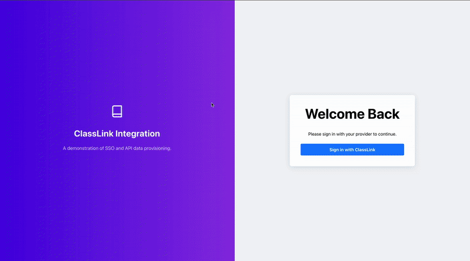

# ClassLink Integration Demo

This project serves as a lightweight application designed to demonstrate a complete, end-to-end integration with the ClassLink ecosystem to improve the efficiency of the partner onboarding process and speed up integration times.

---

## Project Demo

---

## Core Purpose

The goal is to showcase three key functionalities:

- **Data Ingestion & Provisioning:** Connect to the ClassLink Roster Server API, fetch user, class, and enrollment data in batches, and provision it into a cloud database
- **SSO Authentication:** Implement Single Sign-On (SSO) using OAuth2 and OIDC directly with ClassLink LaunchPad, allowing users to sign in with their ClassLink credentials
- **User-Facing Application:** A functional web interface that displays roster data in a dashboard format, with different views for different user roles (student and teacher)

---

## Architecture Overview

This application is built using a **serverless architecture** on Amazon Web Services (AWS), designed for scalability and minimal infrastructure management. The system is split into two parts:

- **Backend:** An AWS Lambda function that handles authentication, user data retrieval, and DynamoDB queries
- **Frontend:** A React-based Single Page Application (SPA) that interacts with the backend via secure HTTP APIs

---

## Backend Components

### 1. Data Ingestion Pipeline

- **Service:** AWS Lambda (`classlink-data-ingestion`)
- **Runtime:** Python
- **Functionality:**
  - Retrieves ClassLink API credentials from **AWS Secrets Manager**
  - Authenticates with ClassLink using the `/applications` endpoint to obtain a **Bearer token** for a specific application
  - Uses this token to fetch **paginated** user, class, and enrollment data from ClassLink's Roster Server API
  - Supports **offset-based paging** to ingest data in chunks (e.g., 1000 users at a time)
  - Inserts the ingested data into **DynamoDB**

#### Pagination Example:
To ingest users in batches:

- `GET /v2/users?limit=1000&offset=0`
- `GET /v2/users?limit=1000&offset=1000`
- `GET /v2/users?limit=1000&offset=2000`

The `offset` tells the API where to start returning results from. For example, `offset=1000` skips the first 1000 users

---

### 2. Database

- **Service:** Amazon DynamoDB
- **Tables:**
  - `Users`: Stores student, teacher, and administrator profiles (including first and last names, user IDs, roles)
  - `Classes`: Stores class metadata (e.g., class names, class IDs)
  - `Enrollments`: Maps users to classes (using userId and classId)

DynamoDB provides a flexible, serverless NoSQL database that scales on demand and integrates easily with Lambda.

---

### 3. Authentication & Secure API

- **Service:** AWS Lambda (`get-user-data`)
- **Functionality:**
  - Handles the OAuth 2.0 Authorization Code flow **directly with ClassLink's LaunchPad**
  - Exchanges the authorization `code` for an access token by calling ClassLink's token endpoint
  - Uses the access token to fetch user information from ClassLink's `/v2/my/info` endpoint
  - Queries DynamoDB to retrieve the user profile, enrollments, and class details
  - Queries enrollment data for teachers to build a full student roster per class
  - Returns consolidated user data as JSON to the frontend
  - Includes CORS headers to allow cross-origin calls from the frontend

> **Note:** This implementation does not use AWS Cognito for authentication but handles OAuth flows manually within the Lambda.

---

## Frontend Components

### 1. Technology Stack

- **Framework:** React
- **Build Tool:** Vite
- **Routing:** React Router DOM

### 2. Key Features

- Implements **SSO login** by redirecting users to ClassLink LaunchPad’s OAuth 2.0 authorization URL
- After successful login, users are redirected **back to the frontend** (e.g., `http://localhost:5173/callback`) with an authorization code
- The frontend sends this code to the backend Lambda, which completes the OAuth token exchange and fetches user data
- Displays a personalized dashboard depending on the user's role:
  - Students see their classes
  - Teachers see their classes and can view rosters with student names and IDs

---

## OAuth 2.0 Authentication Flow

1. User clicks "Sign in with ClassLink" in the frontend
2. User is redirected to ClassLink LaunchPad to authenticate
3. Upon successful authentication, ClassLink redirects the user back to the frontend with an **authorization code**
4. Frontend sends the code to the backend Lambda
5. Backend exchanges the code for an access token with ClassLink
6. Backend uses the access token to fetch user info and roster data from DynamoDB
7. Backend responds with full user data
8. Frontend displays the appropriate dashboard

---

## Getting Started

To run this project locally or deploy it in your own AWS environment, see [**SETUP.md**](./SETUP.md) for installation, environment variables, and infrastructure configuration instructions.

---

## Troubleshooting & Common Issues

- **Expired or invalid authorization codes:** Clear URL parameters and restart the login process
- **Missing users or classes in DynamoDB:** Verify data ingestion Lambda is correctly populating the tables
- **DynamoDB index errors:** Ensure the `classId-userId-index` Global Secondary Index exists on the `Enrollments` table
- **CORS issues:** Confirm the frontend origin matches the `Access-Control-Allow-Origin` header in the backend Lambda

---
